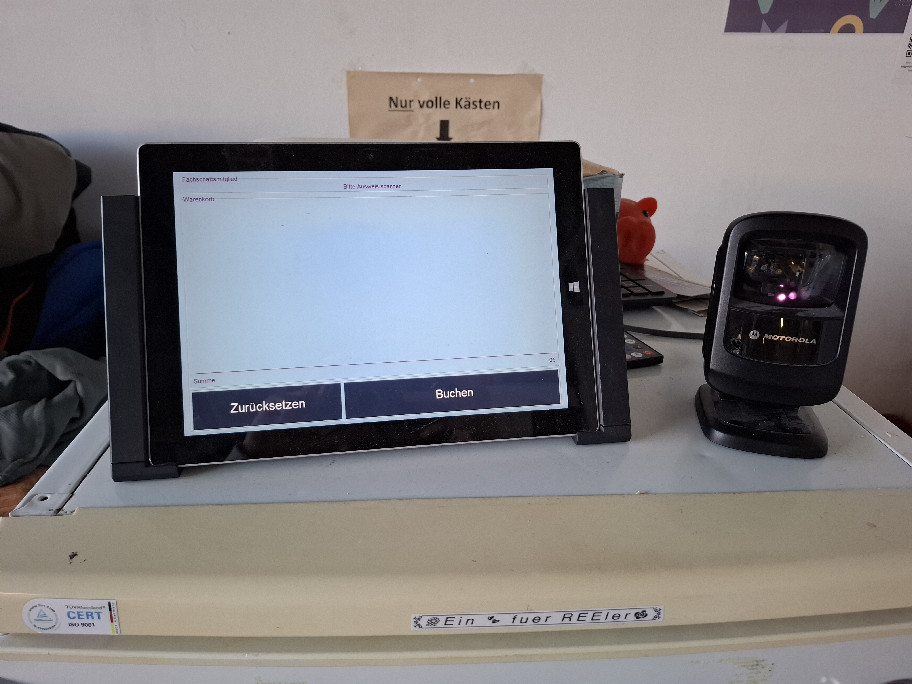

# KM3003

## Description
Der Kühlschrankmanager im Vertretungszimmer der Fachschaft ersetzt die Strichliste, welche früher am Kühlschrank hing, und die Getränkekäufe der Vereinsmitglieder erfasste.

Früher wurden auf der Liste für jedes erworbene Getränk Striche in der Zeile des jeweiligen Mitglieds und in der Spalte des Getränks eingetragen. Regelmäßig zählte man die Striche, ermittelte so die Saldos der Mitglieder und erstellte eine neue Liste.

Der KM3003 ist die Weiterentwicklung der bisherigen Kühlschrankmanager (KM3000 bis KM3002). Der KM3002 basierte auf einem Raspberry Pi mit Touchscreen und NFC-Reader in einem 3D-gedruckten Gehäuse. Mitglieder wurden per Studentenausweis mit NFC identifiziert, und Käufe über den Touchscreen ausgewählt. Die Daten wurden in einer MySQL-Datenbank gespeichert, die jedoch nur negative Salden ermöglichte und so exakte Abrechnungen erzwang. Zudem gab es Verbesserungsbedarf in Codequalität, Zuverlässigkeit und Geschwindigkeit.

Der KM3003 erlaubt nun die Identifizierung von Mitgliedern und Produkten über das Scannen von Barcodes. Mitglieder werden über die Barcodes auf den Studentenausweisen erkannt, Produkte über EAN-Codes. Außerdem erlaubt er nun auch positive Saldos, sodass Mitglieder flexibel Guthaben einzahlen können.

Zusammengefasst ist der KM3003 ein Self-Checkout Point-of-Sale-Gerät mit Touchscreen und Barcode-Scanner.



## Installation
### Windows

1. install python
    - do *NOT* install als admin
    - set the checkbox to add to `PATH`

2. install python libraries
    ```
    python -m pip install pysimplegui pyserial pymysql cryptography
    ```

3. 
    - make a copy of `km3003_sample.conf` and name it `km3003.conf` 
    - customize database info
    - customize COM port

4. TODO: get hobby pysimplegui license key from pysimplegui.com 
 
5. TODO: configure scheduled reboot and updates

### Raspbian standalone

    Notes: For mysql in a docker container, you will need 64bit Raspberry Pi OS

1. Setup database with docker

    mysql docker-compose.yml
    ```yaml
    version: '3'

        services:
        db:
            image: mysql:8.0
            command: --character-set-server=utf8mb4 --collation-server=utf8mb4_unicode_ci
            restart: unless-stopped
            ports:
            - 3306:3306
            volumes:
            - ./mysql:/var/lib/mysql
            env_file:
            - .env
    ```
    .env
    ```ini
    MYSQL_ROOT_PASSWORD=
    MYSQL_DATABASE=
    MYSQL_USER=
    MYSQL_PASSWORD=
    ```

    Copy create statements of real km3003 db and eexcute via mysql workbench for all four databases
    Copy users and product rows via mysql workbench

2. Install python modules

    ```
    pip3 install pyserial --break-system-packages pymysql --break-system-packages pysimplegui
    ```

3. Clone km3003 repo

4. `cp km3003_sample.conf km3003.conf`

5. setup resolution to `800x480` and configure rest of config file

    scanner is probably `/dev/ttyACM0`

6. first start of program... use geanny. Because lazy
7. left button in pysimplegui activation to enter license key
8. start again

## Project status
If you have run out of energy or time for your project, put a note at the top of the README saying that development has slowed down or stopped completely. Someone may choose to fork your project or volunteer to step in as a maintainer or owner, allowing your project to keep going. You can also make an explicit request for maintainers.
